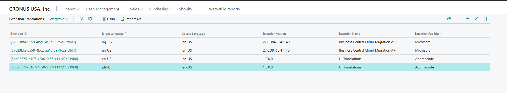
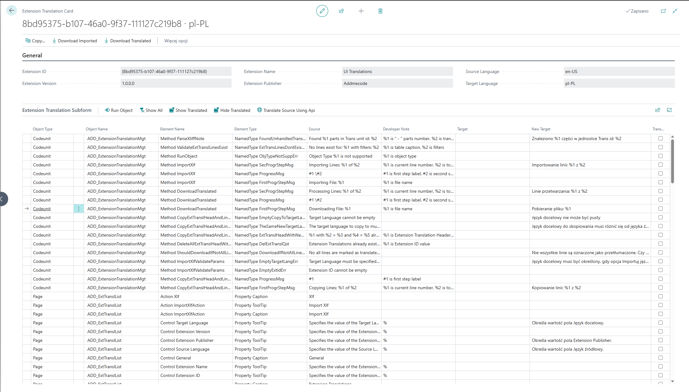

# Extension Translation Tool
 This extension allows to import xlf file to Business Central, select a target language, make translation and export xlf with translated elements.
 The translation can be done manually or using DeepL API.
 The extension from which the imported xlf file originates does not need to be installed in Business Central, to which it is imported.

